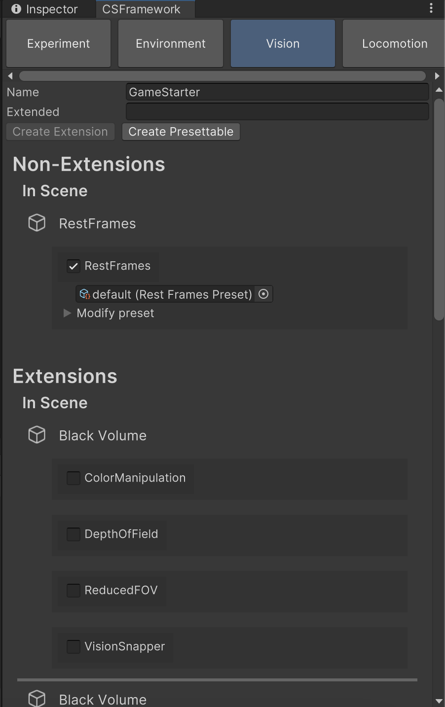
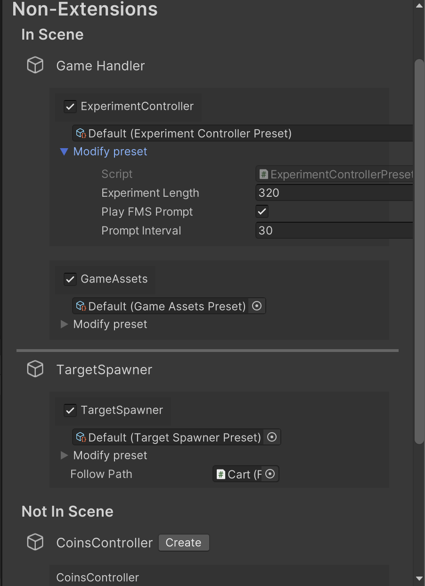
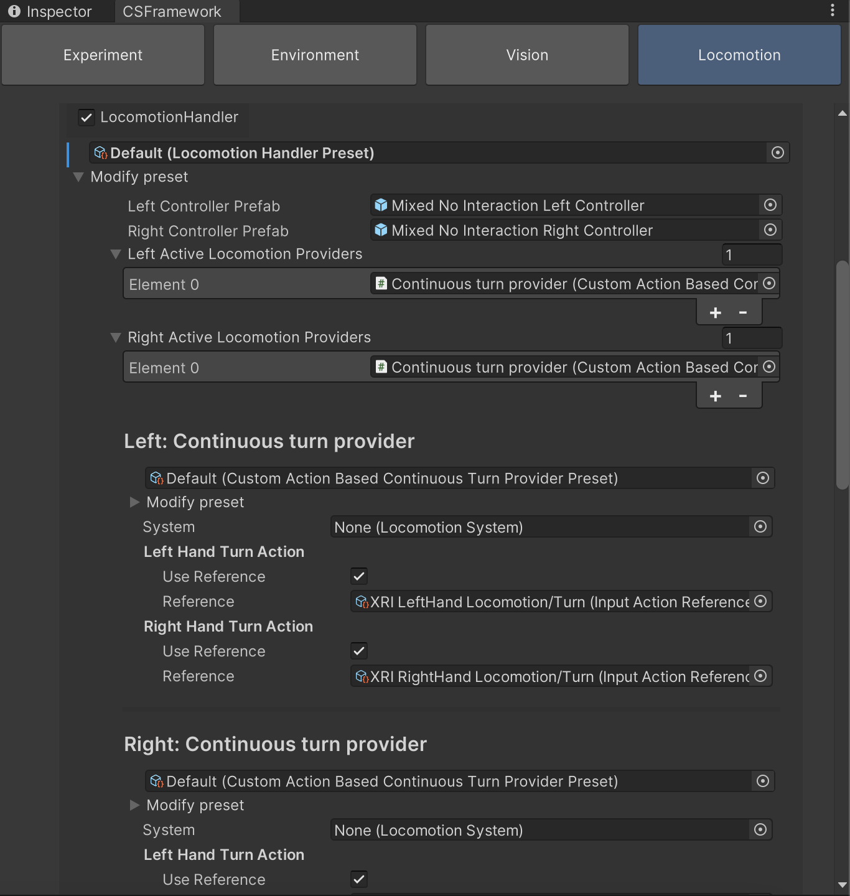
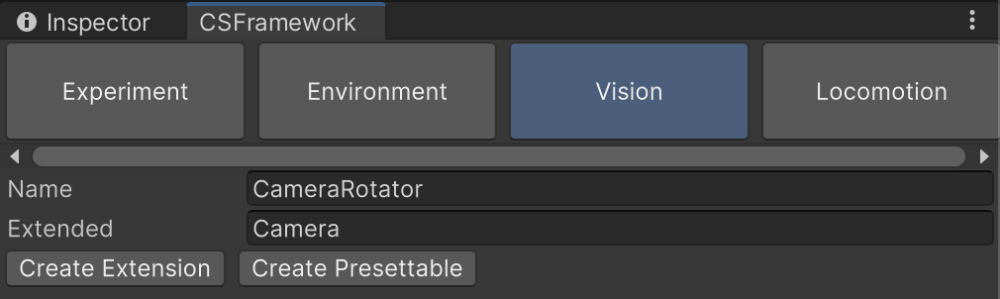

# Cybersickness Assessment Framework
Cybersickness Assessment Framework is a Unity project initialized by Adriano Viegas Milani under the supervision of Nana Tian for the Immersive Interaction Research Group at EPFL. The main idea behind this project is to assist and standardize cybersickness research.
Our solution is a complete Unity Project containing the necessary tools to set up an experiment: a customizable environment, organization for scripts, and an easily shareable preset system for component parameters. This project includes the new version of the framework.

 [**Video Explaining Version 1 of the project**](https://youtu.be/3boUl46NIeg)

### Table of Content
- [Installation Guide](#installation-guide)
   - [Requirements](#requirements)
   - [Installation](#installation)
- [Features](#features)
- [Creating a preset](#creating-a-preset)
- [Use existing features](#use-existing-features)
  - [Using the setup window](#how-to-use-the-setup-window)
  - [Using the `LocomotionHandler`](#how-to-use-the-locomotionhandler)
- [Integrate your own features](#integrate-your-own-features)
  - [Integrating a new script](#how-to-integrate-your-own-scripts-into-the-framework)
  - [Integrating a custom LocomotionProvider](#how-to-integrate-a-custom-locomotionprovider)
- [Glossary](#glossary-for-the-framework)
- [Sources](#sources)
 
## Installation Guide
### Requirements
- Unity Editor 2022.2.11f+
- Unity Universal Render Pipeline
- Unity XR Toolkit
- Git LFS support  

We highly recommend and only officially support the latest LTS version of Unity starting from the given version.

### Installation
- Open a console (or Git bash) in the folder where you wish to install the project and install [Git LFS](https://git-lfs.com/):  
    `git lfs install`
- Clone the project:  
    `git clone [insert SSH code]`
- Open the folder with Unity Editor or by using Unity Hub (using the same or future versions is advised)
- Open the setup window (CSFramework>Setup)
- Open one of the scenes in the folders:
  - Assets>Activities>Coins>Scenes>Coin
  - Assets>Activities>Shooting>Scenes>Shooting
  - Assets>Activities>Common>Scenes>Menu

## Features
The features listed here are the ones specifically added as a possible prevention or reduction technique to cybersickness.  

Experiment - <ins>Personal Sensitivity Test</ins>:   

This test is added to observe participant's individual rotational susceptibility. This feature has a special scene for it but can still be used in other game scenes. The subject is rotated 360 degrees in each axis a total of 9 times (called 'turns') in three groups: {0,1,2}, {1,0,2}, {0,2,1} where 0 = "PITCH", 1 = "YAW", and 2 = "ROLL". The preset parameters:  
  -  Inside Game Scene -> true when the test is not played in its own special scene  
  -  Turn Per Axis -> number of 360 degree rotations per turn (the total amount of turns become 9 * turnPerAxis)  
  -  Turn Duration Per Axis -> the amount of seconds for a single 360 degree turn takes.  
  -  Wait Duration Btw Each Turn -> the time waited after completing a turn and moving onto another axis inside the group (also equal to the time turn axis indicators are shown on the screen)  
  -  Wait Duration Btw 3 Axis Turns -> the time waited between each 3 groups of turns.  
  

Environment - <ins>Background Music</ins>:  
This features adds a looping background music to the scenes. 
  -  [Optional] Music Start -> An initial sequence of a music which will not be looped.
  -  Music Loop -> The music that will be looped throught the game.


Vision:
- Reduced Field of View
- Depth of Field Blur
- Rest Frames (nose and hats)
- Color Manipulation
- Vision Snapper

Locomotion/Movement:
- Teleportation
- Continous movement/ rotation
- Snap rotation
- Grab Move
- Passive Movement

## Creating a Preset
To create a new preset instance, in the folder location of your choice:
    `[right click] > Create > CSFramework > Preset Instances > [Your Preset's category] > [Your Preset's type]`

## Use existing features

### __How to use the setup window__
You can open the setup window from the top bar: `CSFramework > Setup`, we suggest to dock it right next to the inspector and to open it wide enough so that most of its content fit in your screen.



From the top to the bottom, here is an explanation of each component:

- __Category panels__: Each `Presettable` belongs to a category, you will find them in the corresponding panel. To add a new category, you just have to define a new case for the `PresettableCategory` `enum`.
- __Script creation fields and buttons__: They can be used to generate your own `Presettable`s from a template. You can find more information about this in the [integrating a new script](#how-to-integrate-your-own-scripts-into-the-framework) section.


- __Non-extensions__: They are the classes extending `IPresettable` but not `IExtension`. They're separated between the ones which are present in the scene and the ones which are not. 
   
  - __In Scene__
    - If it is in the scene, disabling the toggle next to it name will destroy the attached `GameObject`. 
    - Selecting the circle next to the preset field will display the list of all available preset for this script. You can also drag and drop the `ScriptableObject` file in the field.
    - You can open the _Modify preset_ foldout to display the inspector of the preset and modify its value. Changes are persistent, it is equivalent to modifying the `ScriptableObject` file directly.
  - __Not In Scene__
    - All existing non-extension `Presettable`s for the current category will appear here. You can create any of them by clicking the corresponding button, it will create a new `GameObject` with the same name as the script with the component attached to it.

- __Extensions__: They are the classes extending `IExtension`. Every `GameObject` with a component for which an extension exists will appear in this section and the available extensions for it will be proposed. For example, if you defined an extension `CameraRotator` for the `Camera` component, then each camera in the scene will be displayed in the window and the `CameraRotator` extension will be proposed for all of them. The toggle next to its name will add or remove this component to the associated `GameObject`. As for `PresettableMonoBehaviour`s, you can look at the preset values and modify them directly from the window.

### __How to use the `LocomotionHandler`__
 

The `LocomotionHandler` inspector consists of three sections:
- Left and right controller prefabs  
You need to reference the controller prefabs you want to use for both hands here. For example you may want to use a ray interactor on the left hand and a direct interactor on the right hand, so you have to set them here.
- Left and right active locomotion providers  
These are the locomotion providers that will be used for the left and right hand. If you select the continuous move provider for the left hand and the continuous turn provider for the right hand, only the correct actions will be enabled. Note that in the Coins scene, these settings will be overriden by the in-game ui selected categories. So you shouldn't touch the `LocomotionHandler` in this scene.
- Active locomotion providers' inspector  
The inspector of each active provider will appear from here to modify any settings you want directly from the main window.

## Integrate your own features

### __How to integrate your own scripts into the framework__
#### __Create the files__

To benefit from ready-to-use templates, we suggest that you create your scripts from the window directly. To do so, go to the desired category panel for your script and fill the name of your `Presettable` and the name of the extended type, if you want to create an `Extension`. Then, when clicking on the _Create Presettable_ or the _Create Extension_ buttons, a new `Presettable` script will be generated in the _Assets_ folder, along with its preset.

For example, from the _Vision_ panel, using `CameraRotator` as a name and `Camera` as the extended type and clicking on _Create Extension_ will create a new script called `CameraRotator` which is an `Extension` for `Camera` of category _Vision_ and the corresponding `CameraRotatorPreset`.

#### __Define the fields exposed in the preset__
The default generated preset script will look like this:
```cs
[CreateAssetMenu(menuName = "CSFramework/Preset Instances/Vision/CameraRotatorPreset", fileName = "new CameraRotatorPreset")]
public class CameraRotatorPreset: Preset<CameraRotator>
{
    // TODO replace with your own fields following this format
    [field: SerializeField]
    public int Field { get; private set; }
}
```
We'll quickly go over what each line does
- `CreateAssetMenu` attribute allows us to create a preset instance from the editor directly. It is a common practice to create `ScriptableObject`s.
- `Preset` is the base class for presets in our framework, it takes the type it is a preset for as a type parameter. It extends `ScriptableObject` so that we can create instances of them.
- `[field: SerializeField]` is equivalent to a simple `[SerializeField]` (to modify its value in the inspector) except that without the `field:` annotation it doesn't work with auto-implemented properties. It basically serializes the backing field of the property.
- Although it is not required, we strongly suggest you to declare only `public { get; private set; }` properties so that you can not modify them publicly but you can fetch all of the fields, that's the point of a preset. 

Now, you need to define every field you may want to change in your preset. Following the same example, we will define a `RotationAxis` and a `RotationSpeed` properties.

The final file should look similar to this:
```cs
[CreateAssetMenu(menuName = "CSFramework/Preset Instances/Vision/CameraRotatorPreset", fileName = "new CameraRotatorPreset")]
public class CameraRotatorPreset: Preset<CameraRotator>
{
    [field: SerializeField,
            Tooltip("The axis along which the rotation will be applied")]
    public Vector3 RotationAxis { get; private set; }
    [field: SerializeField,
            Tooltip("The speed of rotation")]
    public float RotationSpeed { get; private set; }
}
```
#### Write the behaviour of the presettable
__PresettableMonoBehaviour__

When creating a non-extension `Presettable`, here is the generated template:
```cs
public class GameStarter : PresettableMonoBehaviour<GameStarterPreset>
{
      public override PresettableCategory GetCategory() => Experiment;
      
      // You can access your Preset's fields: Preset.fieldName
}
```
In this example `GameStarter` is supposed to start the game after some delay, given by its preset.

By extending `PresettableMonoBehaviour<GameStarterPreset>`, a `GameStarterPreset Preset` field is already available to use. You can then define your behaviour as you would normally do for normal `MonoBehaviour`:
```cs
public class GameStarter : PresettableMonoBehaviour<GameStarterPreset>
{
  private float timer;

  private void Awake() => timer = Preset.Delay;

  private void Update()
  {
    timer -= Time.deltaTime;
    if (timer <= 0)
      StartGame();
  }

  private void StartGame() { ... }
  
  public override PresettableCategory GetCategory() => Experiment;
}
```
__Extension__

The same principles can be applied to extensions, with the addition that the generated template includes a `GetComponent<Extended>()` call in `Awake()` to get the extended object. You may replace this call by any other way of getting it. If you don't use directly `GetComponent<Extended>()`, don't forget to remove the `RequireComponent()` attribute.
```cs
[RequireComponent(typeof(Camera))]
public class CameraRotator : Extension<Camera, CameraRotatorPreset>
{
  public override PresettableCategory GetCategory() => Vision;

  private Camera _camera;

  // You can access your Preset's fields: Preset.fieldName
      
  private void Awake()
  {
    // You might want to get your component in another way
    _camera = GetComponent<Camera>();
  }
}
```

In our example, the final script would look like this:
```cs
[RequireComponent(typeof(Camera))]
public class CameraRotator : Extension<Camera, CameraRotatorPreset>
{
  private Camera _camera;
      
  private void Awake() => _camera = GetComponent<Camera>();

  private void Update() => _camera.transform.Rotate(Preset.RotationAxis, Preset.RotationSpeed * Time.deltaTime);

  public override PresettableCategory GetCategory() => Vision;
}
```

You can now add it to the scene and create a preset for it as any other `Presettable`, following the steps presented in [its section](#creating-a-preset).

### __How to integrate a custom `LocomotionProvider`__
Your class needs to extend `LocomotionProvider` or any subclass of it and either `ICustomMovementLocomotionProvider` or `ICustomRotationLocomotionProvider`. We also suggest to make it a `Presettable` by extending `IPresettable<#YourPresetType#>`. As it is already a subclass of `LocomotionProvider` it can not inherit from `PresettableMonoBehaviour`, that's why we're using the interface instead.

By extending these interfaces, you need to define the following methods and properties:
- `public List<InputActionReference> LeftInputReferences, RightInputReferences` represents all the input action references used by this provider attached to the left and right hand respectively
- Either `public RotationType RotationType` or `public MovementType MovementType` depending on the script.
- `public #YourPresetType# Preset` and `public PresettableCategory GetCategory()` if you decided to define a `Presettable`

Here is a typical example, you can find more under `Assets/Common/Scripts/Locomotion/`:
```cs
public class CustomActionBasedContinuousTurnProvider : 
    ActionBasedContinuousTurnProvider, 
    ICustomRotationLocomotionProvider, 
    IPresettable<CustomActionBasedContinuousTurnProviderPreset>
{
    [SerializeField] private CustomActionBasedContinuousTurnProviderPreset preset;

    protected override void Awake()
    {
        base.Awake();

        if (Preset == null) return;
        turnSpeed = Preset.TurnSpeed;
    }

    public List<InputActionReference> LeftInputReferences => new(1) { leftHandTurnAction.reference };
    public List<InputActionReference> RightInputReferences => new(1) { rightHandTurnAction.reference };

    public RotationType RotationType => RotationType.Continuous;

    public PresettableCategory GetCategory() => PresettableCategory.Locomotion;
    public CustomActionBasedContinuousTurnProviderPreset Preset => preset;
}
```
Doing this is sufficient to use it as a part of the `LocomotionHandler`.

## Glossary for the Framework
#### Presettable
A presettable is simply a script that has a `Preset` attached to it. The goal is to facilitate the communication of experiment parameter values for researchers.
#### Extensions
An extension is a special kind of `Presettable` used to provide new functionalites (extensions) to an existing `Monobehaviour`. It is itself a `Monobehaviour` so it should be added as a component to some `GameObject`. 
It is a generic type that takes the `Monobehaviour` it extends as type parameter. We chose to bound it to a unique, specific `Monobehaviour` to be able to display all extensions available for the `GameObject`s in our scene. If they weren't linked to a `Monobehaviour`, every `GameObject` of our Scene would show up in the window we created.
#### Presets  
Each `Presettable` is inherently linked to a `Preset`, given as a type parameter. The goal of the preset is to provide every parameter that we potentially want to share / save to the associated presettable. The `Preset`s are simply `ScriptableObject`s which makes it easy to create different variants of them.

---
## Sources
Environment (trees, bushes, ...) from SimpleNaturePack by JustCreate  
PathCreator Tool by Sebastian Lague  
Coin Sound from Zapsplat.com  
Background music from Jac Cooper's [Game Music Starter Pack](https://www.jaccoopermusic.co.uk/games)
